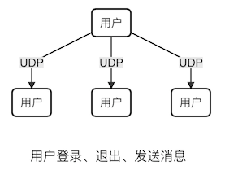
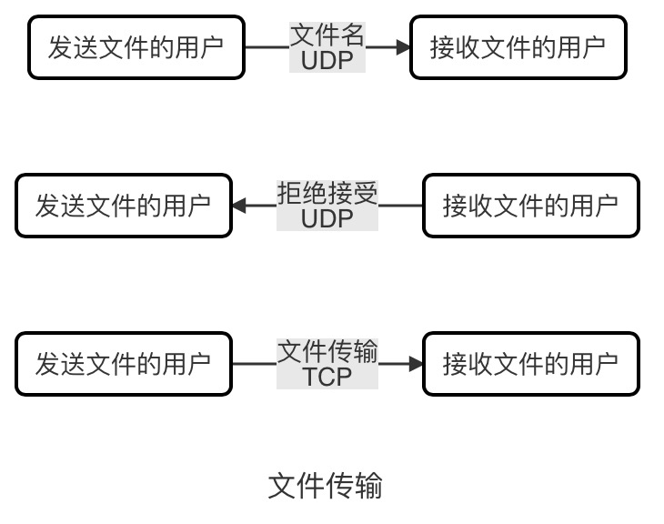

# QQbyQt
使用Qt5开发的局域网聊天室
## 功能介绍
### 聊天功能
运行本程序，在聊天框输入文本，点击发送即可向聊天室发送信息，如果多人在局域网内运行本程序，即可实现局域网聊天。
### 传输文件功能
选中需要发送文件的对象，再点击传文件按钮，选择需要发送的文件，即可向对方发送文件。
### 聊天记录的存储功能
点击保存聊天记录按钮，即可将聊天记录保存到本地名为messageList.txt的文本文件中。
### 聊天记录的搜索功能
在搜索聊天记录框输入需要搜索的关键词，点击搜索，即可查找到与包含关键词的消息记录。

## 功能实现
### 聊天功能的实现
聊天功能是通过UDP广播的方式来实现的，在用户登录进入局域网、退出局域网和发送消息时都会通过广播来告知所有用户，所有用户的聊天窗口进程都是广播的一个端点，既可以发送也可以接收。

| 消息类型 |      用途      |
| :-----: | :-----: |
|   Msg    |  发送聊天消息  |
| UsrEnter |   新用户加入   |
| UsrLeft  | 用户退出聊天室 |
| FileName |  传输的文件名  |
|  Refuse  |  拒绝接收文件  |

### 传输文件功能的实现
传输文件时，发送文件的一方是服务端，接收文件的一方是客户端，服务器在发送文件前首先利用UDP发送文件名，如果客户端拒接接收，则利用UDP返回拒绝应答；若客户端同意接收，则服务器会与客户端建立TCP连接，从而向客户端传送文件。

### 存储聊天记录功能的实现
利用内置的文件存储功能，将聊天记录存储到项目路径下的文本文件中。

### 搜索聊天记录功能的实现
本功能利用KMP算法，将输入的文本作为模式串，与聊天记录进行匹配，从而返回包含对应关键词的消息序列，并以窗口形式展示。

## 功能截图
### 聊天功能截图

### 传输文件截图

